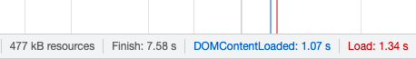
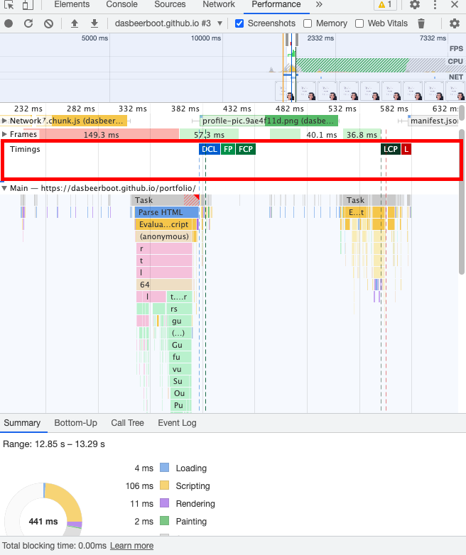

# Web Performance Optimisation on Client's side

## 웹 어플리케이션의 성능 최적화는 왜 필요한가?
구글 리서치 자료에 따르면, 페이지 로드에 3초 이상이 소요되면 53%의 사용자가 페이지를 이탈하며, 표시 속도가 늘어나면 이탈률은 더 높아지게 된다고 한다. 반대로 말하면, 페이지 로드 시간을 줄여 더 나은 사용자 경험을 선사하면 전환율이 증가한다고 볼 수 있다. 실제로 핀터레스트는 페이지 로드 시간을 40% 감소시키면서 검색을 통해 유입된 사용자의 가입 전환율이 15% 증가했다고 한다.  
클라이언트의 리소스 소모를 줄이고 사용자 경험을 개선하기 위해서는 웹 성능 최적화가 필수적이다.  

<br/>

## 웹 어플리케이션의 성능 지표
1. 리소스 기준
    - *DomContentLoaded*, *Load* (from 크롬 개발자 도구)  
    > 크롬 개발자도구 Network 탭의 하단에는 아래와같이 각각의 이벤트 발생 시점이 ms로 표시된다.  
      
2. 사용자 기준  
    - First Paint: 화면에 첫 element가 페인트 된 시점
    - First Contentful Paint: 화면에 이미지나 텍스트 등 컨텐츠가 나타난 시점
    - First Meaningful Paint: 화면에 사용자에게 의미있는 컨텐츠가 나타난 시점
    - Time To Interactive: 자바스크립트 초기 실행이 완료되고, 사용자가 인터렉션 할 수 있는 시점
    > 위 지표들은 크롬 개발자도구 Perforance 탭의 프로파일링 기능을 통해 측정할 수 있다.  
    프로파일링을 실행한 뒤, 아래와 같이 준비된 파일에서 timing 영역을 보면, 위의 사용자 기준 성능 지표들을 확인할 수 있다.  
      
    해당 지표들 중 가장 유의미한 지표는 사용자 경험과 직접적인 연관이 있는 FMP와 TTI라고 볼 수 있다.

<br/>

## 브라우저의 렌더 단계
1. **Parse**: DOM(Document Object Model) 트리 구축을 위한 HTML 파싱(입력된 HTML 텍스트를 조작할 수 있는 객체로 변환)
2. **Style**:  CSS 텍스트 파일에 저장된 스타일을 DOM에 적용할 수 있도록 해석
3. **Layout**: 각 요소들이 화면의 어떤 위치에 배치될지를 결정하는 작업.
4. **Paint**: 여태까지 만들어 온 데이터들을 조합하여 화면을 그리는 작업
5. **Change**: 렌더링은 하나의 이미지를 출력하기 위한 과정이 아님. Interactive 한 어플리케이션을 만들기 위해서는 계속해서 이벤트와 DOM의 변경 등이 일어나게 되는데, 이 때 처음부터 끝까지 화면을 다시 렌더하지 않고 변경이 필요한 요소만 업데이트해야 할 부분을 최소화해서 반영하는, 웹 어플리케이션을 종료할때까지 계속되는 작업


> 참고하면 아주아주 좋은 블로그 포스트 => [보러가기](https://ibocon.tistory.com/251)

<br/>

## 웹 성능 개선방안
웹 어플리케이션의 성능 지표와, 브라우저의 렌더 관계를 살펴봤으니 해당 자료들을 이용해 클라이언트 단에서 웹 성능을 개선시킬 수 있는 방안들을 알아보도록 하자.  
1. ### 페이지 로드 최적화
     - **블록 차단 리소스 최적화** : HTML을 파싱할 때 CSS나 JS를 만나게 되면, 파싱을 중단하고 해당 파일을 우선적으로 파싱하거나 다운로드 한 후 실행하게 되는데, 이렇듯 HTML 파싱을 차단하는 요소를 블록 차단 리소스라고 한다. ([위의 두 번째 이미지](#웹-어플리케이션의-성능-지표)하단에 위치한 "*Total blocking time*" 참고)  
         1. CSS는 `<head>` 태그 안에, `<script>`로 실행되는 JS는 `<body>` 맨 하단에 위치시킨다.
         2. 반응형 어플리케이션의 경우, media attribute로 어떤 디바이스인지에 따라 해당 CSS 적용 여부를 명시한다.
         3. `<noscript>` 사용하기
     - **리소스를 외부에 배치하여 사용** : 리소스를 외부에 배치하여 사용하면 캐싱을 활용할 수 있어 페이지 로드 속도를 향상시킬 수 있다.
     - **DOM 엘리먼트 depth 줄이기**
     - **불필요한 repainting 줄이기** : 크롬 개발자도구의 Rendering 탭을 열고 Paint flashing 옵션을 체크하면 어느 시점에 어떤 영역이 다시 그려지는지 확인이 가능하다.
2. ### Tree shaking  
    트리쉐이킹은 나무를 흔들면 잔가지가 바닥으로 떨어지는 것 처럼, 외부 모듈에서 필요한 기능만 가져오는 것 을 말한다. 
    - **불필요한 코드 제거**
    - **Minify & Uglify 로 코드 용량 최소화**
    - **간결한 CSS 셀렉터 사용**
    - **공통 스타일은 class로 정의하여 사용**
    - **애니메이션은 JS API보다 CSS 사용을 권장**  
3. ### 리소스 요청 갯수 줄이기
    - **웹팩과 같은 모듈 번들러로 JS와 CSS 번들하기** :  
        웹 팩 등 번들러를 이용해 여러 파일의 크기를 줄이고, 하나로 병합하는 것 은 효율적인 방법이다. 하지만 <span style="color:magenta">어플리케이션이 커질수록 번들의 크기도 커진다.</span> 그러므로 코드 분할 또한 염두에 두는 것 이 좋다. 이 또한 웹팩에서 지원한다.  

        - 웹팩으로 번들시 코드 분할(Code Splitting)하기 ([웹팩 공식문서 보러가기](https://webpack.kr/guides/code-splitting/)):  
            1. 웹팩 entry 설정을 사용하여 수동으로 코드 분할하기.  
                ```json
                module.exports = {
                    mode: 'development',
                    entry: {
                        index: './src/index.js',
                        another: './src/another-module.js',
                    }
                },
                ```
                위와 같이 entry에 index 와 another로 나눠 코드를 수동으로 분할할 수 있으나, 엔트리 청크 사이에 중복된 모듈이 있는 경우 중복된 내용이 두 번들에 모두 포함되고, 코어 어플리케이션 로직을 통한 코드의 동적 분할에는 사용할 수 없다는 단점이 있다.  
            2. `Entry dependencies` 또는 `SplitChunksPlugin`을 사용하여 중복 청크를 제거하고 청크 분할하기.
            3. import() 문법(dynamic import) 사용하기.
            ```javascript
                //before
                import { add } from './math';
                console.log(add(16, 26));

                // after
                import("./math").then(math => {
                console.log(math.add(16, 26));
                });
            ```
            위와 같이 모듈을 리액트 파일 최상단에서 import 해와서 쓰는 대신에, import() 문법을 사용하여 코드를 분할할 수 있다. import() 호출은 내부적으로 promises 구문을 사용하므로 async 함수와 함께 사용할 수 있다. 웹팩은 번들링 시 import() 구문을 만나게 되면 어플리케이션의 코드를 분할한다. 
    - **JS, CSS 파일 캐싱하기(server side)** : 캐시의 종류는 브라우저 캐시, 프록시 캐시, 게이트웨이 캐시가 있다.
4. ### 페이지 렌더링 최적화
    브라우저의 렌더 단계 중 세번재 단계인 레이아웃을 최대한 바르게, 최대한 적게 발생시키는 것 을 목표로 하는 최적화 방법.
    - **강제 동기 레이아웃 및 레이아웃 쓰래싱(thrashing) 피하기** :   
    예시)
        ```javascript 
        const tabBtn = document.getElementById('tab_btn');
        tabBtn.style.fontSize = '24px';
        console.log(testBlock.offsetTop); // offsetTop 호출 직전 브라우저 내부에서는 동기 레이아웃이 발생한다.
        tabBtn.style.margin = '10px';
        // 레이아웃
        ```
        위 코드와 같이 레이아웃 과정이 끝나기 전에 JS 코드상에서 DOM 요소의 위치나 크기값을 변경 후 바로 가져오려 할때, 강제로 레이아웃을 발생시키는 것 을 강제 동기 레이아웃이라고 한다. 이러한 렌더는 JS 실행 시간을 늘어나게 하므로 지양해야한다. 이러한 강제 동기 레이아웃이 한 프레임 내에서 연속적으로 발생하는 것을 레이아웃 쓰래싱이라고 하며, 주로 반복문을 이용해 요소의 스타일을 조작할때 발생하며 성능이 더욱 저하된다. 이럴때 반복문 밖에서 요소의 스타일값을 호출하면 레이아웃 쓰래싱을 막을 수 있다.  

   - **DOM element간 의존성 줄이기** : 
        - 부모-자식 관계: 부모 엘리먼트의 height가 가변적인 상태에서 자식 컴포넌트의 height가 변경될 때, 부모 엘리먼트부터 레이아웃이 다시 일어나게 된다. 이때 부모 엘리먼트의 높이를 고정하면 하위 엘리먼트의 height 값 변화에 영향을 받지 않게 된다. 고로, 부모 엘리먼트의 높이를 고정하여 사용하자.
        - `display: inline` 에서 나란히 놓인 요소들 관계: 이 때, 각각의 엘리먼트 width값 변경으로 인해 나머지 엘리먼트들의 위치 변경이 일어나므로 유의하자.  
    -  **`display: none` 이용하기** : `display:none` 과 `visibility: hidden` 은 모두 화면에는 보이지 않지만, visibility 속성을 사용하면 리페인트는 발생하지 않아도 공간을 차지하고 있기 때문에 레이아웃은 발생하게 된다. 사용되지 않는 엘리먼트를 숨길때는 꼭 `display: none`을 이용하자.
    - **`<React.Fragment>` , `<></>` 사용하기** : 리액트 컴포넌트에서 DOM 엘리먼트 반환시, 꼭 부모태그로 감싸져있어야 하는데, 이럴 때 불필요한 부모태그를 만들지 않고 Fragment를 사용하면, DOM에 별도의 노드를 추가하지 않고 자식 엘리먼트들을 그룹화 할 수 있다.


### references
- 웹 성능 최적화: https://blog.fakecoding.com/archives/website-performance-optimize/, https://medium.com/myrealtrip-product/fe-website-perf-part1-6ae5b10e3433
- 브라우저 렌더링 과정: https://boxfoxs.tistory.com/408, https://cresumerjang.github.io/2019/06/24/critical-rendering-path/, https://velog.io/@ru_bryunak/%EB%A0%8C%EB%8D%94%EB%A7%81%EC%9D%B4%EB%9E%80